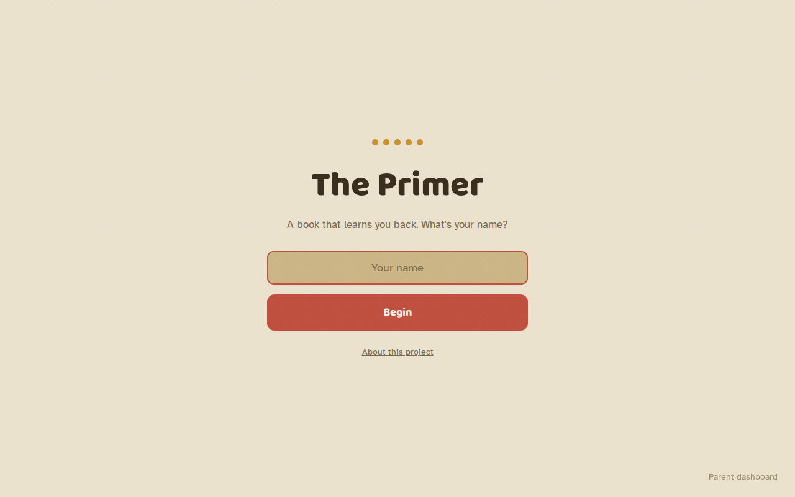
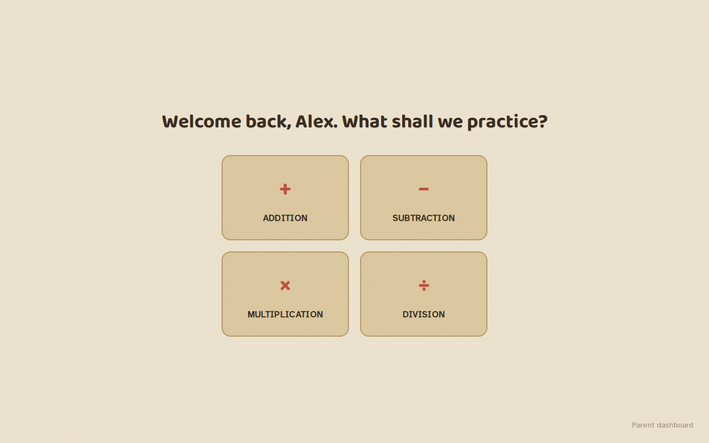
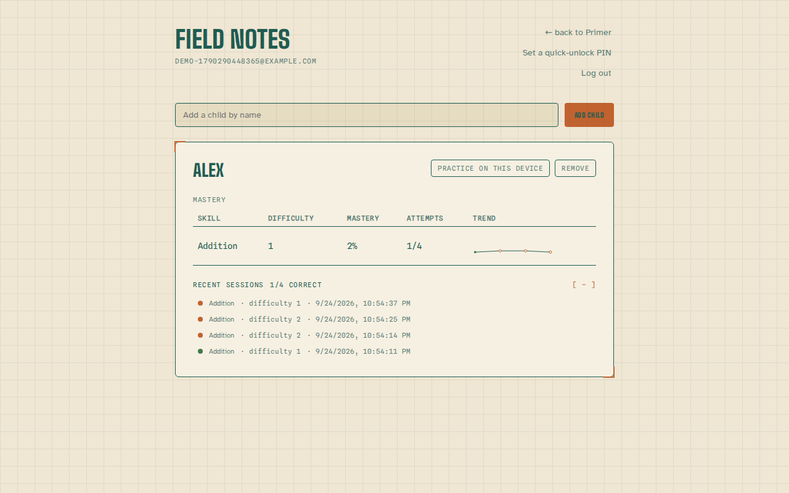

# The Primer

An adaptive arithmetic tutor for kids, built around a real Bayesian
Knowledge Tracing model instead of a fixed problem sequence — difficulty
rises and falls with how a child is actually performing, skill by skill.
Named for the Illustrated Primer from Neal Stephenson's *The Diamond Age*: a
book that teaches by meeting the reader where they are.

**Live:** [the-primer-mu.vercel.app](https://the-primer-mu.vercel.app)
(backend is on Render's free tier — the first request after a period of
inactivity can take up to a minute to wake it up)

## Screenshots

| | |
|---|---|
|  |  |
|  |  |

## What's actually going on under the hood

- **Bayesian Knowledge Tracing, not a lookup table.** Each (child, skill)
  pair has a tracked probability of mastery (`p_know`), updated on every
  attempt from evidence parameters (slip/guess rates) plus a transition
  step — including a deliberate departure from textbook BKT (a `P_FORGET`
  parameter) so a difficulty curve can come back down after a hot streak
  instead of getting permanently stuck. See `backend/app/mastery.py` and
  `ARCHITECTURE.md`'s tech-stack table for the full reasoning, including
  two real bugs the math caught before they shipped (a floating-point
  lockup, and a difficulty swing that was mathematically correct but felt
  jarring to actually play).
- **The LLM never touches grading.** Answer correctness is deterministic,
  computed server-side against operands stored at problem-serve time —
  never against anything the client sends back. Gemini is used only for
  wrong-answer explanations, entirely decoupled from the assessment path,
  and a failed LLM call degrades to "no explanation this time," never a
  failed request.
- **A real security posture, not just a login form.** Argon2id password
  hashing, JWT bearer sessions (deliberately not cookies — see
  `backend/app/auth.py`'s module docstring for the cross-origin CSRF
  reasoning), a PIN-based dashboard-unlock flow with the same
  rate-limiting and enumeration-safety guarantees as the password path,
  opaque per-record UUIDs instead of sequential IDs, and a global error
  handler that never leaks a stack trace or exception detail to a client
  (the frontend got the same treatment this session — see
  `ARCHITECTURE.md`'s "Post-PIN pass").
- **Tested on both ends.** 100+ backend tests (pytest) covering the
  adaptivity math, auth/security edge cases, and rate limiting; a
  frontend suite (Vitest + Testing Library) targeted at regressions that
  actually happened — a double-submission race condition, an error-
  message leak — not coverage for its own sake. Both run in CI on every
  push (`.github/workflows/ci.yml`).

## Tech stack

React · TypeScript · Vite · Python · FastAPI · PostgreSQL (Neon) ·
SQLAlchemy · Alembic · Gemini API · Argon2id · JWT · Vitest · pytest

## Repo layout

- [`backend/`](backend/) — FastAPI service. See
  [`backend/README.md`](backend/README.md) for setup, migrations, and the
  API itself.
- [`frontend/`](frontend/) — React client (child practice UI + parent
  dashboard). See [`frontend/README.md`](frontend/README.md) for setup,
  tests, and project structure.
- [`ARCHITECTURE.md`](ARCHITECTURE.md) — the full, honest build log: every
  real decision, every bug that actually shipped and got caught, every
  deliberately-deferred tradeoff, in the order it happened. Written to be
  the cross-session source of truth, not marketing copy — if you want to
  know *why* something is built the way it is, this is where that lives.

## License

MIT — see [`LICENSE`](LICENSE).
